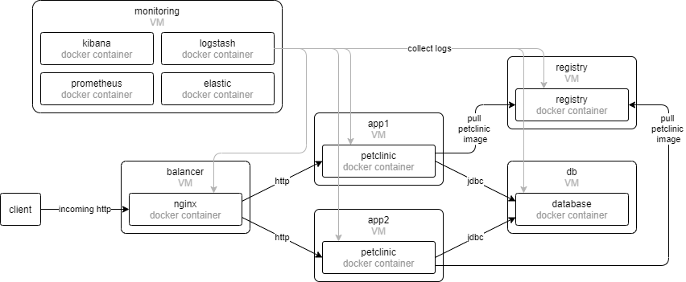

# Hosting dockerized Java application with Vagrant

## Overview

This is an example project that uses [Vagrant](https://www.vagrantup.io/) to manage [VirtualBox](https://www.virtualbox.org/) virtual machines and docker containers.



## Requirements

To get through with all the operations these requirements should be met:

* Vagrant installed locally
* Virtualbox installed locally
* WSL installed, if launched on Windows
* Ansible installed
* The scripts download Vagrant box from [https://cloud-images.ubuntu.com/], maven dependencies and docker images from DockerHub, so a connection to the Internet is mandatory too

## Quick start how-to

### Start up

To setup and start the infrastructure you need to clone this repository and run `scripts/vagrant-init.sh` script:

```bash
git clone https://github.com/n-g-work/vagrant-petclinic.git
cd vagrant-petclinic/
bash ./scripts/vagrant-init.sh
```

### Remove everything

```bash
bash ./scripts/vagrant-remove.sh
```

### Reload and re-provision

```bash
bash ./scripts/vagrant-re-apply.sh
```

## Running Vagrant commands manually

Vagrantfile for the VMs is located within [vagrant/](vagrant/) sub-folder. Assuming that commands will be executed while in the root repository folder, all the vagrant commands are to be prefaced with `VAGRANT_VAGRANTFILE` variable.

### Vagrant up

```bash
VAGRANT_VAGRANTFILE=vagrant/Vagrantfile vagrant up
```

### Vagrant halt

```bash
VAGRANT_VAGRANTFILE=vagrant/Vagrantfile vagrant halt
```

### Access individual VMs over ssh

```bash
VAGRANT_VAGRANTFILE=vagrant/Vagrantfile vagrant ssh machine_name
# for example, access to registry VM:
VAGRANT_VAGRANTFILE=vagrant/Vagrantfile vagrant ssh registry
```

### Vagrant destroy

```bash
VAGRANT_VAGRANTFILE=vagrant/Vagrantfile vagrant destroy
```

### Vagrant status

```bash
VAGRANT_VAGRANTFILE=vagrant/Vagrantfile vagrant status
```

## Customizations

### Change the number of VMs or their hardware specifications

To change the number and parameters of VMs change [vagrant/boxes.json](vagrant/boxes.json).
To apply the changes run the `scripts/vagrant-re-apply.sh`:

```bash
bash ./scripts/vagrant-re-apply.sh
```
