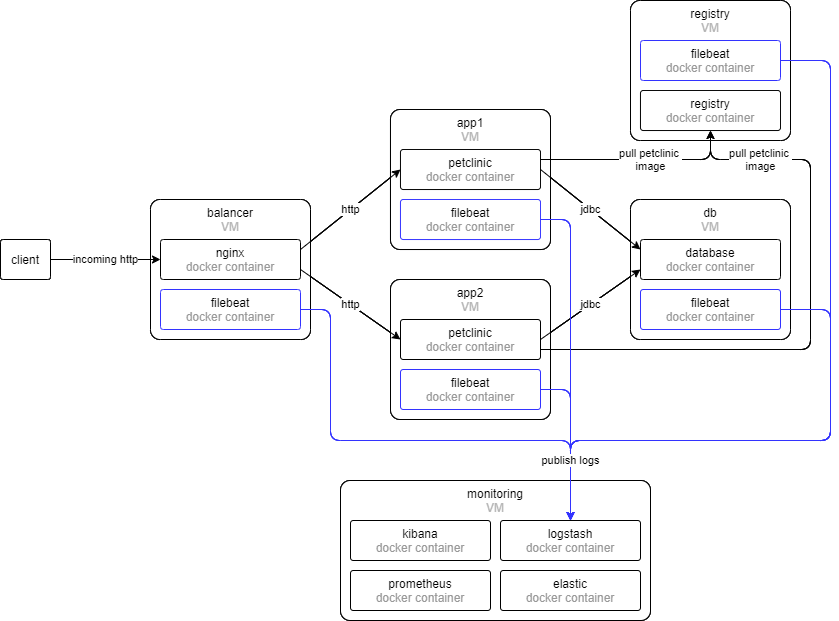

# Hosting dockerized Java application with Vagrant

## Overview

This is an example project that uses [Vagrant](https://www.vagrantup.io/) to manage [VirtualBox](https://www.virtualbox.org/) virtual machines and docker containers.



## Requirements

To get through with all the operations these requirements should be met:

* Vagrant installed locally
* Virtualbox installed locally
* WSL installed, if launched on Windows
* Ansible installed
* Internet connection

## Quick start how-to

### Start up

To setup and start the infrastructure you need to clone this repository and run `scripts/vagrant-init.sh` script:

```bash
git clone https://github.com/n-g-work/vagrant-petclinic.git
cd vagrant-petclinic/
bash ./scripts/vagrant-init.sh
```

### Remove everything

```bash
bash ./scripts/vagrant-remove.sh
```

### Reload and re-provision

```bash
bash ./scripts/vagrant-re-apply.sh
```

## Customizations

To change the number and parameters of VMs change [vagrant/boxes.json](vagrant/boxes.json).
